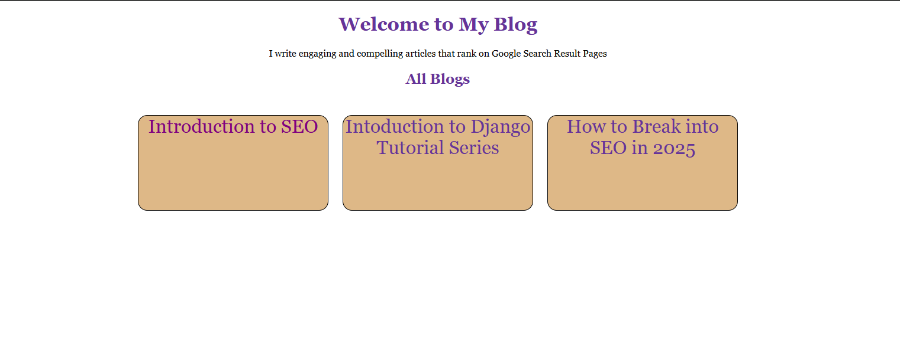

Have you been learning the basics of Django and are now looking for a simple yet practical project to build so you can put your knowledge into practice? If yes, then you have found a goldmine.

This tutorial series will walk you through several Django project ideas for beginners with source code. That way, you are not just learning Django concepts but also building real-world projects and stacking up your portfolio in the process—a win-win.

In this first series, you will build a simple blog website using Django. With this project, you will learn how to route URLs, load static files, and pass dynamic data to templates (HTML) in Django.

Don’t worry if any of these concepts sound unfamiliar to you. Ignore them for now and focus more on understanding the steps in this guide, as I will explain them in the easiest way possible.

:::tip

  Ensure you code along so you get to understand better.

:::


Before we get into it, ensure you have the following:

- A code editor installed on your device. E.g., VSCode

- Basic understanding of HTML, CSS, and Python.

Without any further ado, let’s get into it and build a super-powerful blog website!

<!-- truncate -->


## How to Build a Blog Application With Django

In this tutorial, you will build a simple blog application with a homepage that displays different blog titles. Once any of the blogs is clicked, it will navigate to the web page and display the entire blog.

Here is how the output will look:



## How to Set Up a Django Project
Follow these steps to set up a Django project on your device.

**Step 1**: Create a new folder and open it in your preferred code editor. This guide is using VS Code.

**Step 2**: Open your terminal and enter this command:
` django-admin startproject myblog`

**Step 3**: Change directory into the new folder you just created.
```
cd myblog
```
**Step 4**: Enter this command to create a new Django app.
``` py
 python manage.py startapp blogapp
```
The Django app is a smaller subset of your Django project, and it focuses on a specific feature.

Think of it as a kitchen or living room in a single house (Django Project). Each of these rooms (Django app) performs different functions, but they are still in a single house (Django project). Get that?
Therefore, you can have more than one Django app in a Django project.

**Step 5**: Enter this command to view your site locally.
`python manage.py runserver`

Now, your site should be running locally!

## How to Route URLs in Django

Once your project is up and running, the next step is to route URLs in your project. Why do you need to route Django URLs?

Think of it this way: you have a single website, and you want users to be able to navigate to other subdomains like blog1, blog2, and even the home page. To achieve this, you need to correctly route the URL for each of these pages.

To set this up, you need to first route the URL for the home page in the Django URLs and views file in your project.
Follow these steps to set it up:

**Step 1**: Create a `urls.py` file in your Django app. 
I.e., blogapp.

**Step 2**: Import `path` at the top of your file.
` from django.urls import path`

**Step 3**: Import `views` at the top of your file.
`from  .import views`

**Step 4**: Create a list variable and use the `path` function to define URL patterns.
``` javascript showLineNumbers
urlpatterns = [
    path('', views.index, name="index")
]
```

The `urlpatterns` is a list variable that holds all the URLs in your Django app. In the path function, the empty quotation mark represents the main app, and `view.index` represents the action you want to perform when the page is rendered.

**Step 5**: Navigate to the `views.py` file and create an `index` function.

Note, you are creating an `index` function because you have `views.index` in the URL file. Therefore, the name of the function must match.
``` javascript showLineNumbers
def index ():
    return
```
**Step 5**: Render the HTML file you want to display once you navigate to this URL.

``` javascript showLineNumbers
from django.shortcuts import render
def index (request):
    return render(request, 'index.html')
```

Notice, you have not created an HTML file yet. To do this, you need to set up a template folder.
This template folder is where all the HTML files you want to render will live 

**Step 6**: Create a folder inside your project.

**Step 7**: Create an HTML file in the folder.
E.g., index.html

**Step 8**: Set up the basic HTML template in this file.

``` html showLineNumbers
<head>
    <meta charset="UTF-8">
    <meta name="viewport" content="width=device-width, initial-scale=1.0">
    <title>Document</title>
</head>
```
**Step 9**: Navigate to the `settings.py` file to render your HTML file.

**Step 10**: Scroll down to the (predefined) `TEMPLATES` variable and enter this code inside the brackets.
`BASE_DIR, 'templates'`
:::note

You should replace `templates` with the name of the HTML folder you created.
This will render the HTML files you have created.

:::


The next step is to route your Django app, `blogapp`, in the Django main project.

**Step 11**: Navigate to the `urls.py` in your Django project. 

**Step 12**: Scroll down and use the `include` function to route your Django app.

``` javascript  showLineNumbers
from django.urls import path, include

urlpatterns = [
    path('admin/', admin.site.urls), // there by default
    path('', include('blogapp.urls'))
]
```
**Step 13**: Enter `python manage.py runserver` to view it locally.

:::tip

Enter a single line of code in the HTML file and check if it displays in your local server. 

:::


## How to Set Up Your Blog Home Page 
To set up the home page of your blog, navigate to the HTML file you created earlier and paste the code below:

``` html 
<!-- index.html -->


<!DOCTYPE html>
<html lang="en">
<head>
    <meta charset="UTF-8">
    <meta name="viewport" content="width=device-width, initial-scale=1.0">
    <title>My Blog</title>
    <link rel="stylesheet" href="">
</head>
<body>
    <h1 class="welcomepage"> Welcome to My Blog</h1>
    <div>I write engaging and compelling articles that rank on Google Search Result Pages</div>
    <h2 class="allblogs">All Blogs</h2>
    <div class="groupblogs">
            <div class="each">Blog 1</div>
           <div class="each"> Blog 2</div>
          <div class="each">Blog 3</div>
    </div>
</body>
</html>
```
_**Note**_: You can tweak the code based on the way you want it.

Once you have set up your HTML file, the next step is to add basic styling to the page.
However, linking a CSS file to an HTML file in Django is quite different from the regular way you link your CSS.

Follow these steps to link a CSS file to an HTML file in Django.

**Step 1**: Create a folder named `static` in your Django project.

**Step 2**: Create a CSS file inside the folder. E.g., style.css

**Step 3**: Navigate to the `Settings.py` file in your Django project and enter this code in line 14. I.e., (right under `from pathlib import Path`)

``` javascript showLineNumbers
 import os`
```		
**Step 4**: Scroll down and create a new variable to register your static file.

``` javascript showLineNumbers
  STATICFILES_DIRS = (os.path.join(BASE_DIR, 'static'),)`
```
_**Note**_, place the variable right after `STATIC_URL = 'static/'  `

**Step 5**: Navigate to your HTML file and link the CSS file.
``` css showLineNumbers
   <link rel="stylesheet" href="">`

```
Ensure you place this right in the HTML `head`.

**Step 6**: Load the static file at the top of your HTML.
``` javscript showLineNumbers
`
```

**Step 7**: Write any style in your CSS to check if it has been linked to your HTML file.
Your CSS file should be correctly linked.

Now, you can style your HTML file.

Enter this code in your CSS file.

``` CSS
*{
    font-family:Georgia, 'Times New Roman', Times, serif;
    text-align: center;
}
.welcomepage, .allblogs{
    text-align: center;
    color: rebeccapurple;
}

.groupblogs{
    display: flex;
    gap: 1.5em;
    margin-top: 3em;
    justify-items: center;
    justify-content: center;
}
.each{
    width: 20em;
    height: 10em;
    background-color: burlywood;
    color: white;
    text-align: center;
    border: 1px solid black;
    border-radius: 1em;
}

a{
    text-decoration: none;
    text-decoration-color: none;
    font-size: 2em;
    color: black;
    background-color: burlywood;
    
}
```
Please note that you can adjust the style to suit your preferences.

## How to Dynamically Pass Blog Details to Your HTML File
Notice that each of the blog titles on the home page is hardcoded in the HTML file. The next step is to load the blog's title from the backend dynamically. To do this, follow these steps:

**Step 1**: Navigate to the `views.py` file.

**Step 2**: In the function you created earlier, i.e., `index` (if that is the name you used), create a dictionary variable.
``` javascript showLineNumbers
def index (request):
    context = {
        "blog1": "Introduction to SEO",
        "blog2": "Intoduction to Django Tutorial Series",
        "blog3": "How to Break into SEO in 2025"
    }
    return render(request, 'index.html')
```
The variable `context` is a dictionary that holds all the blog titles you want to display on the index page.
Note that `context` is the conventional name, but you can always change it if you like.

**Step 3**: Render the variable by passing it inside the `render()` function.

``` javascript 
   return render(request, 'index.html', context)
```

**Step 4**: Replace the hardcoded blogs in the HTML.

``` HTML showLineNumbers
   <div class="groupblogs">
            <div class="each">{{blog1}}</div>
           <div class="each"> {{blog2}}</div>
          <div class="each">{{blog3}}</div>
    </div>
```
The two curly braces are used to dynamically display the blog titles in the HTML file. `blog1` represents the first key in the `context` variable you created, i.e., `Introduction to SEO`. Same as `blog2` and `blog3`.

**Step 5**: Enter `python manage.py runserver` to view your site locally. The blog title should display.

Now, the last step is to ensure that once any of these blog titles are clicked, they navigate to the actual full blog for users to read. 

## How to Hyperlink Files in Django

To dynamically hyperlink the blog titles to their respective subdomains once they are clicked, follow these steps:

**Step 1**: Create three HTML files inside the HTML folder you created earlier. I.e., `template`, if that is the name you used.

**Step 2**: Navigate to the `urls.py` file to create a URL for each of these files.

``` javascript showLineNumbers
urlpatterns = [
    path('', views.index, name="index"),
    path('blog1', views.blog1, name="blog1"),
    path('blog2', views.blog2, name="blog2"),
    path('blog3', views.blog3, name="blog3"),
]
```

**Step 3**: Create a function for each of the blog URLs in the `views.py` file

``` javascript showLineNumbers

def blog1(request):

    return render(request, 'blog1.html')

def blog2(request):

    return render(request, 'blog2.html')

def blog3(request):

    return render(request, 'blog3.html')
```
The next step is to hyperlink each of these files to the blog title on the homepage.

**Step 4**: Navigate to the HTML and use `` to hyperlink each of the blogs.

``` HTML showLineNumbers

           <div class="each"><a href="">{{blog1}}</a></div>
           <div class="each"><a href="">{{blog2}}</a></div>
          <div class="each"><a href="{%url 'blog3'}"> {{blog3}}</a></div>
```

**Step 5**: Write the content for each blog in the HTML file.
I.e., blog1, blog2, and blog3.

**Step 6**: Preview the changes locally.

Now, once you click any of the blog titles, it should navigate to the blog file and display the content!

You can add CSS styling to each of the blogs and make them look appealing.

### Frequently Asked Questions About Django Tutorial

**1. Is Django Worth Learning in 2025?**

Yes, Django is worth learning in 2025. This framework offers extensive built-in features that make it easier to build scalable applications. There’s also a high demand for Django developers in various industries, making it a good career opportunity.

**2. Is Flask Better than Django?**

No, Flask is not better than Django. Choosing between the two frameworks depends on your project needs. Flask is best for building simple to middle applications such as REST APIs, blogs, and social media applications. Django, on the other hand, is best for building complex applications such as e-commerce platforms, content management systems, and educational platforms.


**3. Where Can I Host My Django Project for Free?**
You can host your Django projects for free on platforms like [Railway](https://share.google/f3r84ilIo6QJ3Waur), [Koyeb](https://www.koyeb.com/docs/deploy/django), and [Render](https://render.com/docs/deploy-django).

**4. Should I Learn Python or Django First?**

Yes, you should learn the fundamentals of Python before learning Django because all Django components and functionalities are implemented in Python. Your basic knowledge of Python will make it easier to understand Django.

**5. Is Django for Frontend or Backend?**

Django is primarily a backend web framework, but it also offers support for frontend development.


#### Conclusion

Building real-world projects based on the knowledge you have gained is the smartest way to understand Django concepts better, especially as a beginner.

In this Django tutorial for beginners, you have just built a simple blog based on the concepts of Django you have learned. Now, you can route URLs in Django, load static files, and even add dynamic data from the backend! Isn’t that amazing? You should feel proud of yourself for making it this far.

Now, you can even challenge yourself by adding more blogs to the homepage, styling the blog content, or even rebuilding the project from scratch without referring back to this guide. 

That is all for the first series in this Django tutorial; see you in the next one!


