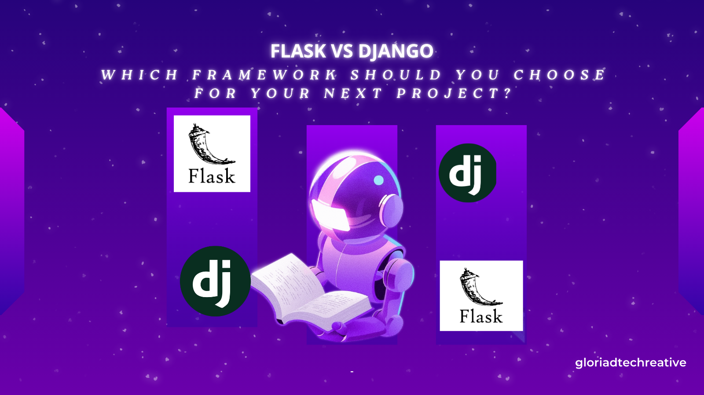

One minute, you’re getting pumped up to bring your next project idea to life; the next minute, you’re unsure of which web framework to choose between Flask and Django. Things can even get more confusing when you keep reading different viewpoints on why one is better than the other. 

To help you make the right choice, this article will show you reasons why Flask or Django might be the best framework for your project based on their inherent features. You’ll also get to compare the differences between both frameworks, their common use cases, and, most importantly, you’ll know the best framework to choose for your next project once you’re done reading this guide. Let’s get into it.

## Reasons Why You Should Consider Flask for Your Next Project 

[Flask](https://flask.palletsprojects.com/en/stable/) is a lightweight, micro web framework for Python that allows developers to build and scale web applications quickly. This framework provides the essential tools that developers need to set up and build their project, which gives them the flexibility to seamlessly integrate other libraries and modules based on their project requirements.
Here is why Flask might be a great choice for your next project:

### 1. Flexibility:
If you want total flexibility over your application, Flask offers it by default. This framework doesn’t shove built-in features down your throat. Instead, it provides you with only the essential tools you need and gives you the flexibility to choose different libraries or tools that are suitable for your project. 

For example, you have the flexibility to choose a specific database, determine how you want to handle authentication logic, and choose any frontend technologies based on your preference and experience as a developer. There are no strict rules; just go with what works well for you and your project.

### 2. Scalability:
If you want a framework that efficiently handles your application even as your code base grows, then you should consider Flask. This framework has a built-in [Blueprint tool](https://www.geeksforgeeks.org/python/flask-blueprints/) that allows you to organize related functionalities into a single reusable component. This modularized structure makes it easier to maintain your code base even as it grows.

For example, you can have an admin interface in a single blueprint to manage users or view analytics and use it across different projects that require an admin area, such as an e-commerce site, a blog, or a learning platform.

Flask also uses standard specifications such as the [Web Server Gateway Interface (WSGI)](https://builtin.com/data-science/wsgi) servers to handle multiple concurrent requests. Some notable large applications, such as Netflix, Reddit, Red Hat, and Twilio, are using Flask in their infrastructure.

### 3. Ease of Learning: 
If you are looking for a framework that is easy to understand, Flask is a great choice. Flask's approach of providing only the essential tools developers need to set up their application makes it easier to understand its core concepts and build your application quickly.
There are also tons of comprehensive learning resources, including beginner-friendly documentation, online tutorials, and articles, that make the learning and building process smooth for you.

## Reasons Why You Should Consider Django for Your Next Project 

[Django](https://www.djangoproject.com/) is a full-stack web framework that provides developers with all the necessary tools and functions they need to develop both the backend and a significant part of the frontend of a web application within a single framework.

Here is why Django might be a great choice for your next project:

### 1. Rapid Development:
If you need a framework that quickly builds your project without delaying you with the overhead of repetitive tasks, then consider Django. It offers a comprehensive set of built-in features that speed up development and eliminate the stress of selecting the right tools.

For example, the admin interface in Django allows you to create, read, update, and delete data without writing any frontend code. It also has an authentication system that enables you to manage user accounts and an object-relational mapper (ORM) to simplify database operations.

### 2. Security:
If your project requires a high level of security, consider using Django. This framework provides extensive built-in security features to protect web applications from vulnerabilities and attacks. 

For example, Django uses a [Cross-Site Request Forgery (CSRF)](https://www.blackduck.com/glossary/what-is-csrf.html) token to prevent CSRF attacks, i.e., attacks that trick users' browsers into performing unwanted and malicious actions such as changing user passwords or making unauthorized transactions.

Although developers still need to adhere to core security practices, such as using HTTPS to encrypt communication and regularly conducting security audits to identify and prevent potential vulnerabilities. 

### 3. Versatility:
Django is a highly versatile framework that allows you to build a wide range of applications. Whether you want to build an e-commerce platform, a content management system, social sites, or APIs, you can use Django to easily bring them to life.

## Flask vs. Django: What are the Key Differences?

Flask and Django are the best Python frameworks for web development; however, they have their differences. Flask is suitable for smaller applications, while Django is best for complex applications. Flask requires manual configuration, while Django provides built-in tools. Flask is easy to learn, while Django has a steeper learning curve.

| S/N | Flask | Django |
|----------|----------|----------|
|1| A microframework with limited built-in features|A full-stack Framework with extensive built-in features|
|2 |Suitable for smaller applications such as APIs and Microservice|Suitable for complex applications such as social sites, e-commerce, and educational platforms|
|3 |Requires manual configuration of components like authentication|Facilitates rapid development due to built-in features like an authentication system and admin interfaces.|
|4| Highly flexible| Rigid and has a predefined structure|
| 5    | Easy to learn due to its minimalism and simplicity|Has a steeper learning curve due to complex features.|

## Common Use Case of Flask

Flask is commonly used for building RESTful APIs, lightweight applications, and for rapid prototyping.

### 1. RESTful APIs:
Most developers often prefer to use the Flask framework for building [RESTful APIs](https://aws.amazon.com/what-is-cloud-computing/) due to its flexibility and ease of use. It provides a powerful routing system that enables developers to define URL patterns and map them to specific functions in their applications. It also speeds up the development process by offering extensive libraries for various functionalities like database integration, authentication, request parsing, etc.

So, if the next project you want to build is a RESTful API, consider using Flask; it is easy to set up and also offers you the flexibility to choose specific tools based on your project needs.

### 2. Lightweight Applications:
Flask is often used to build lightweight applications such as blog apps, news apps, CAPTCHA validation apps, etc., due to its flexibility and simplicity.

### 3. Rapid Prototyping:
Flask is commonly used for prototyping, i.e., the process of building a simple version of an app to test its functionalities before building the whole app. Its minimal setup makes it easy for developers to create the prototype of their applications with a few lines of code. In addition,  Flask offers numerous extensions that add various functionalities, such as user authentication, form handling, and database integration, to scale up the prototype to a full application.

## Common Use Case of Django
Django, as a full-stack framework with extensive built-in features, is commonly used for building e-commerce applications, social network platforms, and educational applications.

### 1. E-commerce: 
Django is commonly used for building e-commerce applications due to its extensive toolkits that speed up development time. For example, its admin interface enables developers to easily manage product information, track orders, and manage user accounts. Django’s ORM also makes it easy for developers to manage large datasets, including product data, user data, and transactional data.

So, if you’re planning to build an e-commerce application and want to avoid the complex process of building specific features or functionalities from scratch, consider using Django.  It has all the essential features and tools you need to build and set up your e-commerce application quickly.

### 2. Social Network Platforms: 
Django is commonly used for building social network platforms based on its inherent scalable architecture. Its architecture supports the integration of robust caching frameworks and efficient load balancing strategies to distribute heavy user traffic and handle large volumes of data and expensive computations on social media apps. Popular social media platforms like Instagram, with over 1 billion active users, use Django in their infrastructure to efficiently manage vast amounts of data.

So, if the next project you want to bring to life is a social media application, consider using Django to benefit from its scalable architecture and robust authentication and authorization system.

### 3. Educational Platforms:
Django’s extensive toolkits also make the framework a great choice for most developers when building educational platforms. Its built-in tools, like the authentication system, make it easy to manage user accounts and course content. 

Django also seamlessly integrates with machine learning libraries, which enables enhanced features such as personalized learning and recommendations for students.

Whether you're building an online course platform like Udemy or educational resource websites like Khan Academy, you can benefit from Django's extensive capabilities to build your project.

## When to Choose Flask and Django: Final Verdict

Now that you have examined the features, differences, and common use cases of Flask and Django, which should you choose for your project?

- In general, you should consider Flask when building RESTful APIs, small- to medium-sized applications, and when you want full control over your application functionalities.

- Django, on the other hand, is best for building highly customizable applications that require maximum security and have the potential to scale up in the future.
  
### Frequently Asked Questions About Django and Flask Frameworks

**1. What Can Django Do That Flask Cannot?**

Django’s comprehensive set of built-in tools allows you to perform specific functionalities that are not inherently available in the Flask framework. For example, the built-in admin interface in Django makes it easy for you to manage database models and data; meanwhile, you have to manually integrate extensions like Flask-Admin when using the Flask framework. 

**2. Which is More Secure, Flask or Django?**

Django is generally considered more secure than Flask based on its built-in security tools, such as a Cross-Site Request Forgery (CSRF) token to prevent CSRF attacks, Object Relational Mappers (ORMS) to prevent SQL injection, and the use of the [PBKDF2 algorithm and SHA256](https://docs.djangoproject.com/en/5.2/topics/auth/passwords/#:~:text=By%20default%2C%20Django%20uses%20the,of%20computing%20time%20to%20break.)  to hash passwords.

**3. Should I learn Flask or Django in 2025?**

The choice ultimately depends on your preference and the type of project you want to build. If you want a framework that is easy to understand and allows you to build small- to medium-sized applications with ease, you should learn Flask. However, if you want a framework that offers extensive built-in features and makes it easy to build complex applications, you should learn  Django.

**4. Can Django Be Used For Full-stack?**

Yes, Django can be used for full-stack development. It has robust features and tools that enable developers to handle both the backend and frontend logic of their application.

**5. Are Flask Developers Still in High Demand in 2025?**

Yes, Flask developers are still in high demand in 2025 for backend roles and API development

#### Conclusion
Choosing between these two popular web frameworks for Python, Flask and Django, can be tricky. Both frameworks have their unique strengths, weaknesses, and best use cases. 

However, this guide has made the ultimate choice much easier by highlighting the reasons why each framework might be a great choice for your project. It also outlined Flask vs. Django's major differences, as well as the common projects for which each is best suited.

Now, you can confidently choose the framework that suits your next project needs and bring it to life. Happy building!

